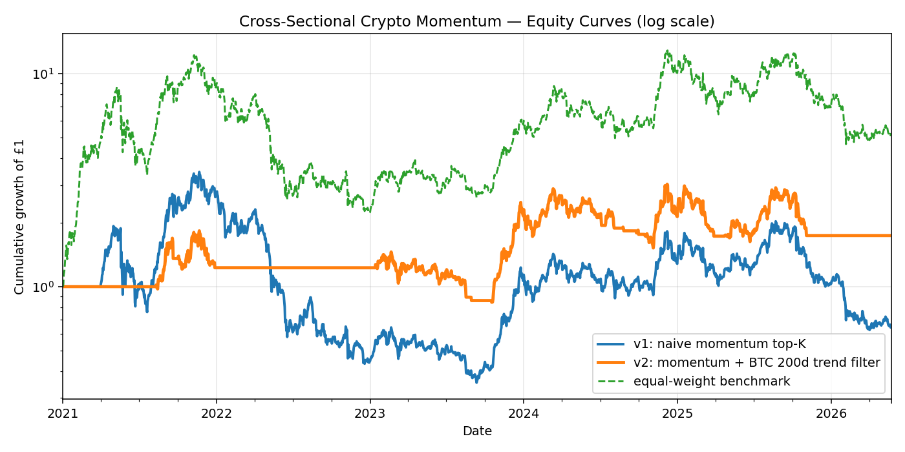
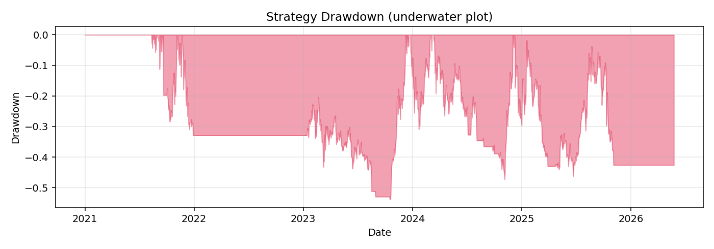

# Cross-Sectional Crypto Momentum — Backtest & Diagnosis

A self-contained backtest of a long-only cross-sectional momentum strategy
on a universe of 10 large-cap USD crypto pairs, evaluated against an
equal-weight buy-and-hold benchmark.

The repo deliberately ships **two strategy versions** to demonstrate the
research iteration:

- **v1 — naive cross-sectional momentum** (top-3 by trailing 60-day return,
  monthly rebalance). Loses money over 2021–2026 and underperforms benchmark
  with t-statistic −2.5.
- **v2 — momentum + BTC 200-day trend filter** (deploy capital only when
  BTC is above its 200-day moving average). Recovers positive return,
  approximately halves the max drawdown vs both v1 and benchmark, but still
  does not beat equal-weight buy-and-hold on a Sharpe basis in this sample.

The honest read-out: naive cross-sectional momentum on this universe is
**dominated by buy-and-hold over 2021–2026**. The trend filter is genuinely
useful as a drawdown control — not as an alpha source.

---

## Results

| metric | v1 naive | v2 + BTC 200d trend filter | benchmark (equal-weight) |
|---|---:|---:|---:|
| annualised return | -7.7% | +10.8% | +35.6% |
| annualised vol | 74.3% | 48.9% | 75.6% |
| Sharpe (rf = 4%) | -0.16 | 0.14 | 0.42 |
| max drawdown | -89.8% | -53.8% | -81.9% |
| daily hit rate | 49.7% | 25.6% | 52.5% |
| annual turnover | 11.1x | 14.9x | 0.0x |
| t-stat (excess daily vs bench) | -2.54 | -1.36 | — |
| information ratio vs bench | -1.09 | -0.58 | — |

Sample: 2021-01-01 → 2026-05-25, daily close (yfinance).





---

## Findings

1. **Buy-and-hold dominates.** Equal-weight large-cap crypto returned
   35.6% annualised with Sharpe 0.42 over 2021–2026. Momentum has to beat
   that — and doesn't.
2. **Naive momentum is anti-selecting at turning points.** Top-3 trailing
   60-day winners are reliably late-cycle bubble names (think LUNA-like
   episodes) that mean-revert harder than the field. t-stat −2.5 vs
   benchmark is statistically significant underperformance.
3. **Regime filter cuts drawdown roughly in half.** The 200-day BTC trend
   filter takes max drawdown from −89.8% (v1) and −81.9% (benchmark) down
   to −53.8%. That is a real risk-management improvement even though it
   does not generate alpha.
4. **Turnover is high and corrosive.** v2 turns over ~15× per year. At the
   modelled 10 bps round-trip cost, that eats ~75 bps annual — meaningful
   but not the main driver of underperformance.
5. **Conclusion.** This particular momentum specification on this
   particular universe is not a strategy. The trend filter is useful as a
   defensive overlay on any long-only crypto exposure. The next research
   direction would be: (a) long-short cross-sectional momentum, (b) risk-
   parity weighting instead of equal-weight, (c) finer-grained universe
   (~50 assets) where dispersion is larger.

---

## Methodology

- **Universe.** Top-10 USD crypto pairs by market cap: BTC, ETH, SOL,
  BNB, XRP, ADA, AVAX, LINK, DOT, LTC. Universe is fixed in advance — no
  survivorship bias from end-of-period selection.
- **Signal.** Trailing 60-day percentage return.
- **Portfolio construction.** At each month-end rebalance, hold the top-K
  assets equal-weighted (K = 3 for v1/v2). Cash otherwise.
- **Trend filter (v2).** Multiply weights by 1{BTC > BTC 200-day MA}.
  When BTC is below its 200-day MA on the rebalance bar, hold cash.
- **Costs.** 10 bps round-trip transaction cost on turnover (5 bps each
  side per leg).
- **Risk-free rate.** 4% annual flat for Sharpe.
- **Annualisation.** 365 days per year (crypto trades daily).
- **No look-ahead.** Returns use yesterday-close weights against today's
  return.

---

## Reproduce

```bash
pip install yfinance pandas matplotlib numpy
python backtest.py
```

Outputs `metrics.json`, `results.csv`, `equity_curve.png`, `drawdown.png`
in the repo root.

---

## Limitations & honest caveats

- Single sample period (2021–2026). Crypto regimes change fast; this is one
  draw from a small distribution.
- Universe selected with hindsight (the 10 names that are large-cap today).
- No slippage, no exchange-specific borrow costs, no taxes.
- Long-only by construction. Long-short would change the picture
  materially.
- Monthly rebalance is a coarse choice — daily or vol-targeted rebalance
  would change turnover and risk dynamics.

---

## Author

Isaac Dodds — github.com/IsaacDodds. Built as a self-directed quant
research exercise alongside MSc Advanced Machine Learning at the
University of Bath and preparation for Summer 2027 quantitative
internship applications.
